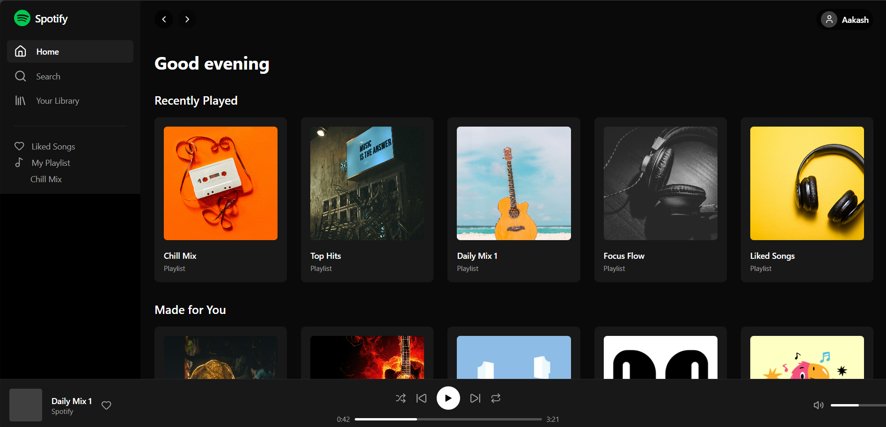
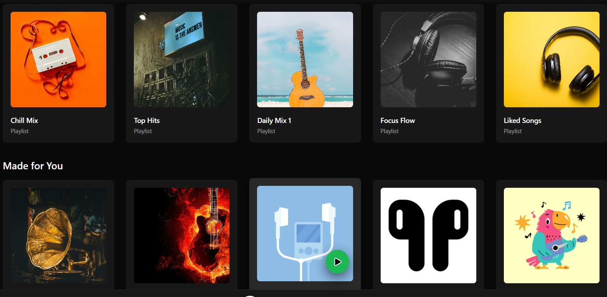
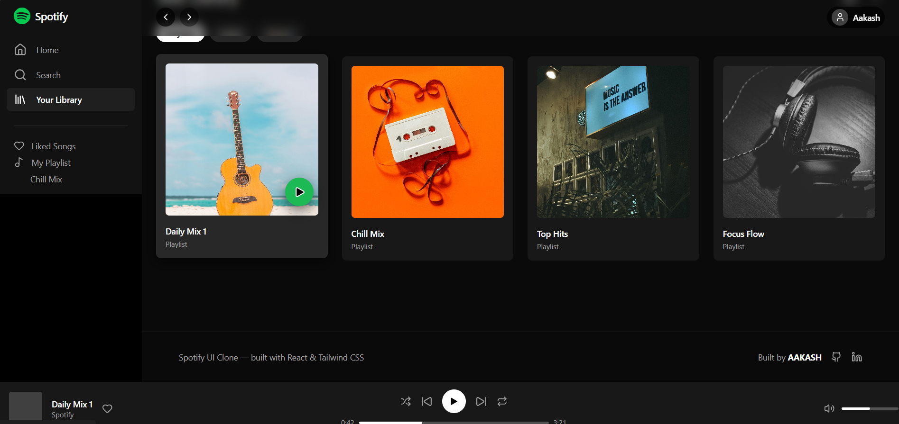

# 🎧 Spotify Web UI Clone

A pixel-accurate **Spotify Web UI clone** built using **React, Tailwind CSS, and React Router**.  
This project focuses on recreating Spotify’s layout, interactions, and visual behavior — not backend or audio streaming.

## 🌐 Live Demo
🔗 https://spotify-ui-clone-zeta.vercel.app/

---

## 🚀 Features

- 🎵 Home page with hover-play cards
- 📁 Library page with filters & grid/list toggle
- 📀 Playlist detail page with track list
- ▶️ Persistent player bar UI
- 🌫️ Scroll-reactive top navigation bar
- 🖼️ Real playlist/album cover images
- 🎨 Smooth hover & transition effects
- 📱 Fully responsive layout

---

## 🛠️ Tech Stack

- **React**
- **Tailwind CSS**
- **Create React Router**
- **Vite**
- **Lucide Icons**

---

## 📸 Screenshots

### Home

### Playlist

### Library

---

## 🧠 What I Focused On

- UI accuracy & spacing
- Component reusability
- Smooth user interactions
- Realistic app-like behavior
- Clean folder structure

This project was built as a **frontend UI showcase**, not a functional music player.

---

## 👤 Author

**Akash Kumar Saw**

- GitHub: https://github.com/aako-aakash  
- LinkedIn: https://www.linkedin.com/in/akash-kumar-saw-bb1630258/

---

## 📄 License

This project is for educational and portfolio purposes only.
